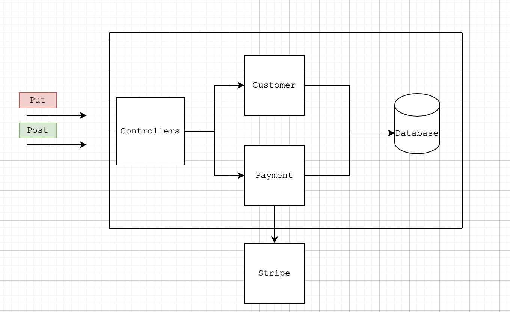

# Introduction into Spring Boot Testing

It is a sample project that illustration testing in Spring Boot.

### About the project:
it is a sample application that imitates 
an e-commerce activity with the following 
domain model and functionality.
 

### Architecture

The project architecture represents a layered
architecture consisting of three layers
- Controllers - a layer responsible for interaction with outer services or API.
- Business Logic - a layer responsible for business logic of the project,
persisting data, making outer API calls, exception handling, etc. 
- Data Access Layer - a layer responsible for database interaction i.e. making select,
  insert, delete queries.

### Domain model
The domain model of the system consists of two entities:
- Customer
- Payment 

### Functionality
- register a new customer
- making a payment

### Testing
To test the whole application, we test it layer by layer,
starting from database layer:
- To test the functionality with database interaction,
[@DataJpaTest](https://docs.spring.io/spring-boot/docs/current/api/org/springframework/boot/test/autoconfigure/orm/jpa/DataJpaTest.html) is used. 
All the tests related to database lie in the com/javajedi/repository folder
- To test the business logic [Mockito](https://site.mockito.org/) framework was used. This tests lies the folder - service
- For testing the whole application as a single unit, 
  we used [@MockMvc](https://docs.spring.io/spring-framework/docs/current/javadoc-api/org/springframework/test/web/servlet/MockMvc.html).
  It enables imitating sending request from the client that triggers controller and the whole business logic.
  This tests lies the folder - integration
  

